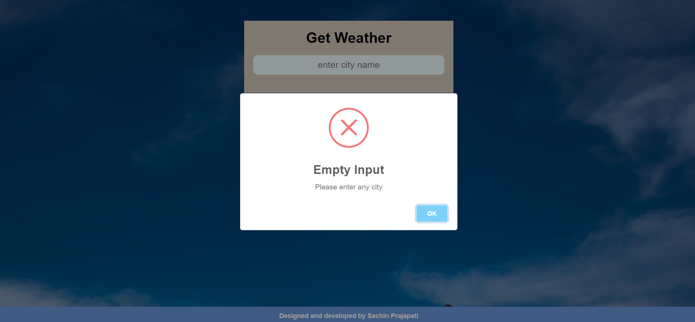

# Weather Mini Project
The purpose of this small project is to display the current weather for a user-specified location.Weather forecasting is the application of science and technology to predict the conditions of the atmosphere for a given location and time.Weather forecasts have a wide range of applications. The fact that weather alerts are used to safeguard people and property makes them crucial. Temperature and precipitation forecasts are crucial.

# FEATURES:
Choose a Weather API Provider:

There are several free and paid weather API providers to choose from, such as OpenWeatherMap, WeatherAPI, and AccuWeather.

Display the Weather Data:

Finally, display the weather data in a user-friendly way, either on the console or in a graphical user interface (GUI) if you want to build a desktop or web application. Dynamic background images change according to weather status. Dynamic weather icon change according to weather status. It provide basic information like feels like temperature,humidity,pressure,wind speed.It will not accept empty input.

User-Friendly Interface:

Simple and intuitive interface for easy navigation and usage.

# TECHNOLOGIES USED:
HTML: Markup language for structuring the web page.

CSS: Stylesheet language for styling the web page.

JavaScript: Programming language for fetching and displaying real-time weather data.

Weather API: For this project, we have used the OpenWeatherMap API (https://openweathermap.org/api) to retrieve the current weather data.

## Web link 
   https://sanjith77.github.io/Weather/

 
# Snapshot

* Default 

* when you entered any valid city
 

* when you did'nt entered anything 
 

* when entered city did'nt matched with data
 

